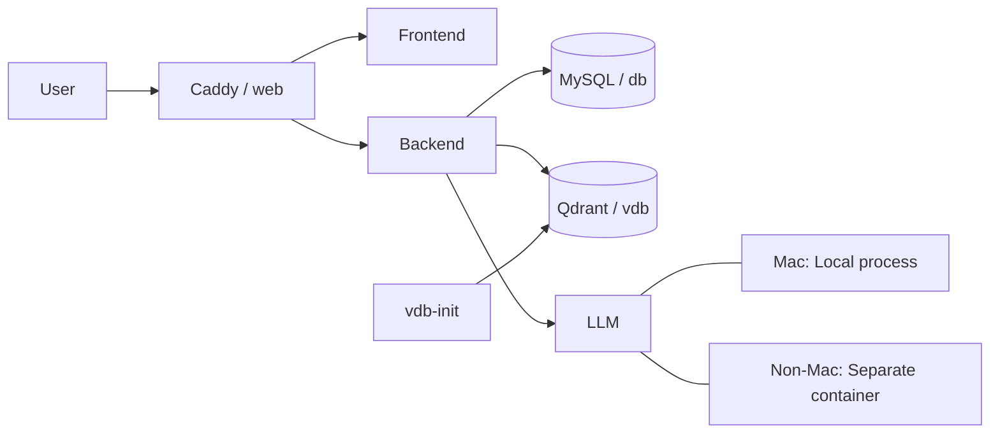

# Architecture

## 全体像

このリポジトリは、Docker Compose を中心にフロントエンド、バックエンド、MySQL、Qdrant、Caddy をまとめて動かす構成です。

役割は次のとおりです。

- `frontend`: 画面を提供するフロントエンド
- `backend`: API を提供するバックエンド
- `web`: Caddy。HTTP の入口としてリクエストを振り分ける
- `db`: MySQL。通常のリレーショナルデータを保存する
- `vdb`: Qdrant。ベクトル検索用のデータを保存する
- `vdb-init`: Qdrant のコレクションを初期作成する補助コンテナ

## サービスの流れ

利用者はまず `web` にアクセスします。
Caddy が受けたリクエストを、URL パスに応じて `frontend` か `backend` に転送します。

バックエンドは必要に応じて次のデータストアを使います。

- `db` で通常の業務データを扱う
- `vdb` で埋め込みベクトルや類似検索を扱う

この分離によって、通常の構造化データと、意味検索用のデータを別々に管理できます。

## LLM の実行場所

LLM は環境によって動かし方を分けます。

- Mac の場合はローカルで動かす
- Mac 以外の場合は別コンテナで動かす

どちらの環境でも、LLM は `9000` ポートで動作する前提です。
バックエンドからは `:9000` に接続すればよいので、実行場所が変わっても接続先の考え方をそろえやすくなります。

`docker-compose.yml` では backend 側を `19000:9000` にしているので、ホストからは `19000`、コンテナ間通信では `9000` を使います。

## ポート対応

このプロジェクトで使っている主なポートは次のとおりです。

- `8080`: Caddy の公開ポート
- `13000`: frontend の公開ポート
- `19000`: backend の公開ポート
- `13306`: MySQL の公開ポート
- `6333`: Qdrant の HTTP API
- `6334`: Qdrant の gRPC API

ローカル開発では、ブラウザや `curl` から `8080` と `6333` を使うことが多いです。

## ディレクトリ構成

設定や永続データは `.docker` 配下にまとめています。

- `.docker/caddy`: Caddy の設定
- `.docker/mysql/data`: MySQL の永続データ
- `.docker/qdrant`: Qdrant の設定、コレクション定義、初期化スクリプト
- `docs`: 使い方や構成の説明

コード本体は外部リポジトリを `build.context` で参照しています。
このリポジトリは、アプリ本体というより「開発用の統合環境」を担っています。

## Qdrant との関係

Qdrant の詳細は [docs/qdrant.md](/Users/kubo/Desktop/furumi_work/llm/docs/qdrant.md) に分けています。

この architecture ドキュメントでは、Qdrant は「ベクトル検索を担当するデータベース」として覚えておけば十分です。
コレクションの管理方法や追加手順は Qdrant ドキュメントを参照してください。

## 開発時の見方

初学者は、まず次の順番で理解すると全体を追いやすいです。

1. `web` が入口になる
2. `frontend` が画面を返す
3. `backend` が API と処理を担当する
4. `db` が通常データを保存する
5. `vdb` が検索用ベクトルを保存する

## 起動の入口

全体を起動するときは `docker compose up -d` を使います。
個別に確認したい場合は、次のように分けて見ます。

- 画面確認: `http://localhost:8080`
- Qdrant 確認: `http://localhost:6333/readyz`
- MySQL 確認: `localhost:13306`

## 補足

`docker-compose_mac.yml` は Mac 向けのローカル開発用設定です。
必要に応じて、ホスト側のソースコードをコンテナへマウントするために使います。
